# Modelo de datos

Fecha: 2026-08-11 · Fase 2 (persistencia y dominio)

Fuente exacta: `prisma/schema.prisma`. Este documento narra las decisiones; el
esquema es la fuente de verdad ante cualquier discrepancia.

## 1. Bloques del modelo

1. **Autenticación** (`User`, `Session`, `Account`, `Verification`) — esquema compatible con el adaptador de Prisma de Better Auth. Sin tabla de contraseñas paralela: la contraseña del proveedor `credential` vive en `Account.password`. `User.role` (`ADMIN` / `SALES` / `CONTENT`) es el único campo propio añadido.
2. **CRM** (`Lead`, `LeadRequest`, `ConsentEvent`, `LeadActivity`, `LeadNote`, `FollowUpTask`, `Tag`/`LeadTag`, `ScoringRule`, `NotificationLog`, `AuditEvent`).
3. **CMS** (`ContentEntry`, `ContentTranslation`, `ContentMedia`, `ContentProvider`, `ContentMenuSection`/`ContentMenuItem`, `ContentTimelineItem`, `ContentHighlight`).
4. **Acceso e interacción** (`VipAccessSession`, `ContentInteraction`).

## 2. Diagrama ER (compacto)

```mermaid
erDiagram
  USER {
    string id PK
    string email
    Role role
  }
  SESSION { string id PK }
  ACCOUNT { string id PK }

  LEAD {
    string id PK
    string emailNormalized "único"
    LeadLifecycle lifecycle
    int score
  }
  LEAD_REQUEST {
    string id PK
    string leadId FK
    LeadRequestStatus status
    string ownerId FK
  }
  CONSENT_EVENT { string id PK }
  LEAD_ACTIVITY { string id PK }
  LEAD_NOTE { string id PK }
  FOLLOW_UP_TASK { string id PK }
  TAG { string id PK }
  LEAD_TAG { string leadId FK }
  SCORING_RULE { string key PK }
  NOTIFICATION_LOG { string id PK }
  AUDIT_EVENT { string id PK }

  CONTENT_ENTRY {
    string id PK
    ContentType type
    string slug "único por type"
    ContentStatus status
    boolean isDemo
  }
  CONTENT_TRANSLATION { string id PK }
  CONTENT_MEDIA { string id PK }
  CONTENT_PROVIDER { string id PK }
  CONTENT_MENU_SECTION { string id PK }
  CONTENT_MENU_ITEM { string id PK }
  CONTENT_TIMELINE_ITEM { string id PK }
  CONTENT_HIGHLIGHT { string id PK }

  VIP_ACCESS_SESSION {
    string id PK
    string tokenHash "único, nunca el token en claro"
  }
  CONTENT_INTERACTION { string id PK }

  USER ||--o{ SESSION : autentica
  USER ||--o{ ACCOUNT : autentica
  USER ||--o{ LEAD_REQUEST : "posee (owner)"
  USER ||--o{ LEAD_ACTIVITY : actor
  USER ||--o{ LEAD_NOTE : autor
  USER ||--o{ FOLLOW_UP_TASK : asignado
  USER ||--o{ CONTENT_ENTRY : "crea/edita"
  USER ||--o{ AUDIT_EVENT : actor

  LEAD ||--o{ LEAD_REQUEST : tiene
  LEAD ||--o{ CONSENT_EVENT : tiene
  LEAD ||--o{ LEAD_ACTIVITY : tiene
  LEAD ||--o{ LEAD_NOTE : tiene
  LEAD ||--o{ FOLLOW_UP_TASK : tiene
  LEAD ||--o{ LEAD_TAG : tiene
  LEAD ||--o{ VIP_ACCESS_SESSION : tiene
  LEAD ||--o{ CONTENT_INTERACTION : genera
  LEAD ||--o{ NOTIFICATION_LOG : recibe
  TAG ||--o{ LEAD_TAG : etiqueta

  LEAD_REQUEST ||--o{ LEAD_ACTIVITY : contextualiza

  CONTENT_ENTRY ||--o{ CONTENT_TRANSLATION : tiene
  CONTENT_ENTRY ||--o{ CONTENT_MEDIA : tiene
  CONTENT_ENTRY ||--o{ CONTENT_PROVIDER : tiene
  CONTENT_MEDIA ||--o{ CONTENT_PROVIDER : ilustra
  CONTENT_ENTRY ||--o{ CONTENT_MENU_SECTION : tiene
  CONTENT_MENU_SECTION ||--o{ CONTENT_MENU_ITEM : tiene
  CONTENT_ENTRY ||--o{ CONTENT_TIMELINE_ITEM : tiene
  CONTENT_ENTRY ||--o{ CONTENT_HIGHLIGHT : tiene
  CONTENT_ENTRY ||--o{ LEAD_ACTIVITY : referenciado_en
  CONTENT_ENTRY ||--o{ CONTENT_INTERACTION : referenciado_en
```

## 3. Decisiones e invariantes que no están (ni pueden estar) en el esquema

- **Un Lead, muchas LeadRequest.** `Lead.emailNormalized` es único; `LeadRequest` nunca se actualiza para "fundir" una petición nueva con una antigua — cada envío de formulario crea una fila. Garantizado por el servicio `createLeadRequest` (`lib/domain/lead-requests.ts`), no por una restricción de BD (no hay forma de expresar "no hagas update" a nivel de esquema).
- **ConsentEvent es inmutable.** No tiene `updatedAt` a propósito. Una revocación es una fila nueva con `granted=false`, nunca un `UPDATE` sobre la fila anterior.
- **Traducción `ES` obligatoria, `EN` opcional.** `ContentTranslation` solo tiene un `@@unique([contentEntryId, locale])`; Prisma no puede expresar "debe existir al menos una fila con locale=ES". Lo valida `createContentEntry`/`publishContentEntry` en `lib/domain/content.ts`, lanzando `MissingTranslationError` si falta.
- **Pipeline con transiciones válidas.** `LeadRequestStatus` es un enum plano de cinco valores desde la Fase 21 —`CONTACT`, `PRESENTATION`, `PROPOSAL`, `CLIENT`, `LOST`, antes eran nueve—; la máquina de estados (qué transición es válida desde cada fase, `CLIENT` terminal, `LOST` reabre a `CONTACT`, un paso hacia atrás permitido, `LOST` exige `lostReason`) vive en `changeLeadRequestStatus` (`lib/domain/lead-requests.ts`), no en el esquema. La reducción se hizo con migración (`20260814120000_pipeline_cinco_fases`) y **no es reversible**: tres estados antiguos caen en `PRESENTATION`.
- **`metadata` seguro.** `LeadActivity.metadata` y `AuditEvent.metadata` son `Json` sin restricción de forma a nivel de columna. `lib/domain/metadata.ts` sanea (quita claves tipo `password`/`token`/`secret`/`ip`/`userAgent`, trunca strings largos, limita profundidad) antes de escribir. Postgres no puede validar esto por sí solo sin un trigger/constraint adicional que no se ha añadido en esta fase.
- **Token VIP nunca en claro.** `VipAccessSession.tokenHash` es un HMAC-SHA256 con clave rotable (`lib/security/hash.ts`); el token real solo existe en memoria en el momento de generarlo y se entrega una vez al llamador.
- **Contenido demo oculto en producción.** `ContentEntry.isDemo` no cambia el comportamiento de escritura; lo hace el filtro de lectura en `listPublishedContent`/`getPublishedContentBySlug`, que excluyen `isDemo=true` salvo `ENABLE_DEMO_CONTENT=true`.

## 4. Índices y su propósito

| Índice | Para qué |
|---|---|
| `Lead.emailNormalized` (único) | Deduplicación — es la clave de negocio real del Lead |
| `Lead.lifecycle`, `Lead.lastActivityAt` | Listados/filtros del CRM |
| `ContentEntry.[type, slug]` (único) | Slugs únicos por tipo (una boda y un catering pueden compartir slug) |
| `ContentEntry.[type, status, sortOrder]` | Listado público ordenado por tipo |
| `ContentEntry.[status, publishedAt]` | Listado por fecha de publicación |
| `LeadRequest.[status, ownerId, nextActionAt]` | Bandeja de trabajo comercial (pipeline Kanban/tabla) |
| `LeadRequest.[utmSource, utmMedium, utmCampaign]` | Informes de atribución, sin indexar cada campo UTM por separado |
| `ContentInteraction.[leadId, createdAt]` / `[contentEntryId, createdAt]` | Timeline de interacción por lead y por contenido |
| `FollowUpTask.[assigneeId, status, dueAt]` | Bandeja de tareas por responsable |

## 5. Borrado en cascada: dónde sí y dónde no

- **Cascada desde `Lead`** hacia todo lo que le pertenece en exclusiva (`LeadRequest`, `ConsentEvent`, `LeadActivity`, `LeadNote`, `LeadTag`, `VipAccessSession`, `ContentInteraction`, `FollowUpTask`, `NotificationLog`): si un Lead se borra de verdad (operación manual, no la anonimización habitual), se borra su rastro completo con él.
- **`SetNull` en las referencias "de contexto"** (`LeadActivity.actorId/leadRequestId/contentEntryId`, `AuditEvent.actorId`, `LeadNote.authorId`, `FollowUpTask.assigneeId`, `LeadRequest.ownerId`, `ContentEntry.createdById/updatedById`, `ContentInteraction.contentEntryId`): si se borra un `User` o un `ContentEntry`, la traza de actividad/auditoría de otros registros **sobrevive** con esa referencia a null. Borrar un usuario no debe borrar el historial de los leads que atendió.
- **La anonimización nunca borra filas.** `anonymizeLead` (`lib/domain/leads.ts`) sustituye los campos identificativos y cambia `lifecycle`, pero conserva `LeadRequest`/`LeadActivity`/etc. para no destruir la trazabilidad comercial ni la auditoría.

## 6. Seed de desarrollo

`prisma/seed.ts` (ejecutable con `npm run db:seed`):

1. 3 usuarios ficticios (`ADMIN`, `SALES`, `CONTENT`) — sin credenciales todavía (Better Auth no está instalado en esta fase).
2. Las 8 `ScoringRule` iniciales de `project-reference/docs/03-arquitectura-crm-leads.md`.
3. Los 6 casos de ejemplo de `data/vip-stories.ts` (3 `REAL_WEDDING` + 3 `CATERING_EVENT`), migrados a `ContentEntry` con `isDemo=true` y `status=PUBLISHED`. `data/vip-stories.ts` **no se ha borrado todavía** (instrucción explícita de esta fase): el frontend público sigue leyendo de ese archivo estático hasta que se conecte a `ContentEntry` en una fase posterior.

El seed es idempotente: si el `ContentEntry` de un slug ya existe, se omite en vez de duplicarlo o fallar.
